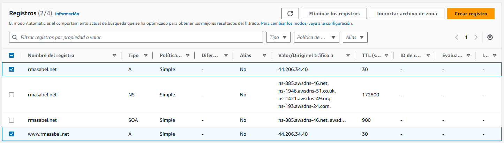
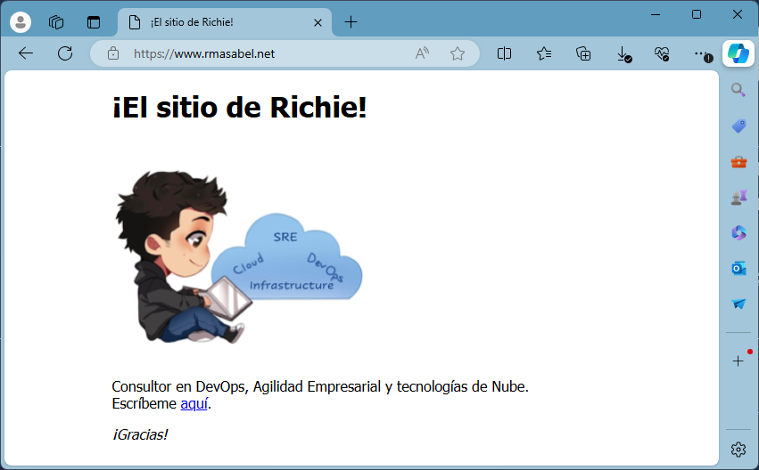
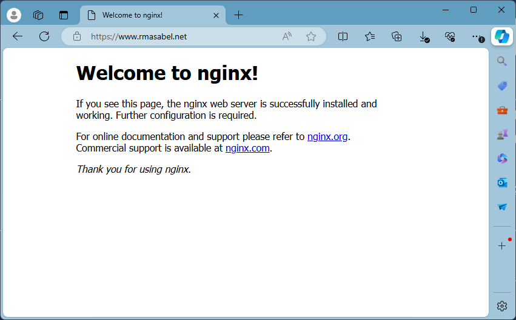
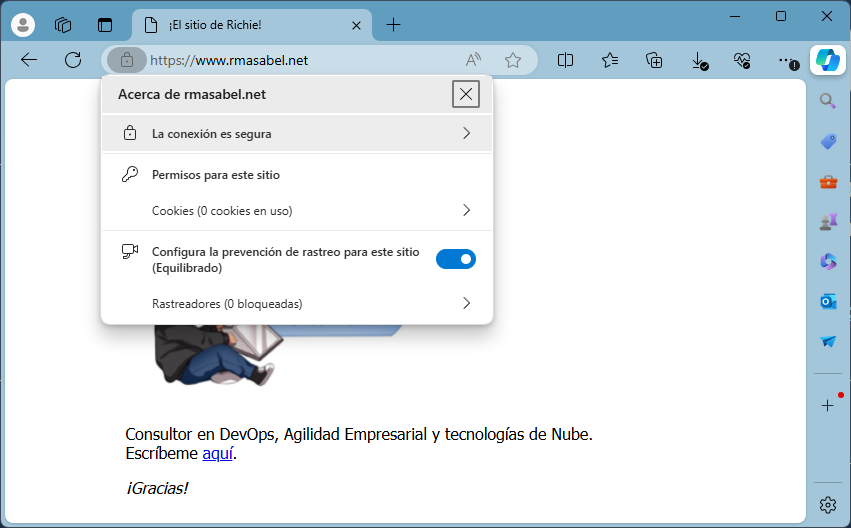
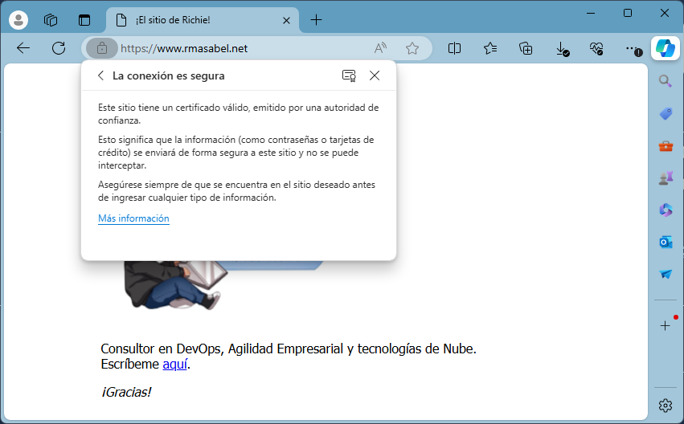

# SSL/TLS Email Server Demo on AWS EC2 using Amazon Linux 2023

- [SSL/TLS Email Server Demo on AWS EC2 using Amazon Linux 2023](#ssltls-email-server-demo-on-aws-ec2-using-amazon-linux-2023)
  - [Web server configuration](#web-server-configuration)
  - [Domain name configuration](#domain-name-configuration)
  - [SSL/TLS configuration for web server](#ssltls-configuration-for-web-server)
  - [SMTP server configuration](#smtp-server-configuration)
  - [IMAP server configuration](#imap-server-configuration)
  - [Certificate auto-renewal](#certificate-auto-renewal)

## Web server configuration

1. Lets update the packages

   ```
   sudo dnf update -y
   ```

2. Let's upgrade the updatable packages

   ```
   sudo dnf upgrade -y
   ```

3. Install NginX package

   ```
   sudo dnf install nginx -y
   ```

4. Verify NginX package installation

   ```
   sudo nginx -v
   ```

5. Start NginX

   ```
   sudo systemctl start nginx.service
   ```

6. Check NginX status

   ```
   sudo systemctl status nginx.service
   ```

7. Set NginX auto-start

   ```
   sudo systemctl enable nginx.service
   ```

8. Allow inbound http and https traffic

   ```
   sudo dnf install firewalld -y
   sudo systemctl start firewalld
   sudo systemctl enable firewalld
   sudo firewall-cmd --get-active-zones
   sudo firewall-cmd --zone=public --add-service=http
   sudo firewall-cmd --zone=public --add-service=https
   sudo firewall-cmd --permanent --zone=public --add-service=http
   sudo firewall-cmd --permanent --zone=public --add-service=https
   sudo firewall-cmd --reload
   ```

9. Test NginX home page through HTTP using our public IP address (**remember to update the public IP address**)

   ```
   curl 44.206.34.40
   ```

## Domain name configuration

10. Create NginX configuration file for our domain (**remember to update the web site domain name**)
    
    ```
    sudo nano /etc/nginx/conf.d/www.rmasabel.net.conf
    ```

    And paste the contents for the file (**remember to update the domain name 02 times**)

    ```
    server {
        listen 80 default_server;
        listen [::]:80 default_server;
        root /var/www/html;
        server_name rmasabel.net www.rmasabel.net;
    }
    ```

    Finally, copy the contents of the default NginX site to the new path

    ```
    sudo mkdir /var/www
    sudo cp /usr/share/nginx/html /var/www -r
    ```

11. Now we should reload our NginX service using our updated settings

    ```
    sudo nginx -t && sudo nginx -s reload
    ```

12. Now, we must update our DNS configuration so we have two A records (for both the **default** and the **www** subdomains)

    

13. Test NginX home page through HTTP using our domain name via curl (**remember to update the domain name**)

    ```
    curl www.rmasabel.net
    ```

    The system will return the HTML code for our home page. I have customized the home page, so you should get the default NginX home page HTML code.

    ```
    <!DOCTYPE html>
    <html>
    <head>
    <title>&iexcl;El sitio de Richie!</title>
    <style>
    html { color-scheme: light dark; }
    body { width: 35em; margin: 0 auto;
    font-family: Tahoma, Verdana, Arial, sans-serif; }
    </style>
    </head>
    <body>
    <h1>&iexcl;El sitio de Richie!</h1>
    <p></p>

    <p>Consultor en DevOps, Agilidad Empresarial y tecnolog&iacute;as de Nube.<br/>
    Escr&iacute;beme <a href="mailto:ricardo.masabel@outlook.com?subject=Correo desde el sitio web">aqu&iacute;</a>.</p>

    <p><em>&iexcl;Gracias!</em></p>
    </body>
    </html>
    ```

    If we try our default subdomain (**remember to update the domain name again**), it should also work fine

    ```
    curl rmasabel.net
    ```

## SSL/TLS configuration for web server

14. Install Let's Encrypt package

    ```
    sudo dnf install augeas-libs-y
    sudo python3 -m venv /opt/certbot/
    sudo /opt/certbot/bin/pip install --upgrade pip
    sudo /opt/certbot/bin/pip install certbot certbot-nginx
    sudo ln -s /opt/certbot/bin/certbot /usr/bin/certbot
    ```

15. Now, we must obtain our SSL/TLS certificate

    ```
    sudo certbot --nginx -d rmasabel.net -d www.rmasabel.net
    ```

    The system will ask for our email and a couple of confirmations (for terms of service and communications from the Electronic Frontier Foundation) and after some processing should show a message like this:

    ```
    ...

    Deploying certificate
    Successfully deployed certificate for rmasabel.net to /etc/nginx/conf.d/www.rmasabel.net.conf
    Successfully deployed certificate for www.rmasabel.net to /etc/nginx/conf.d/www.rmasabel.net.conf
    Congratulations! You have successfully enabled HTTPS on https://rmasabel.net and https://www.rmasabel.net
    
    NEXT STEPS:
    ...
    ```

16. We may now review our updated NginX configuration file
    
    ```
    sudo cat /etc/nginx/conf.d/www.rmasabel.net.conf
    ```

    We will appreciate the changes regarding the new SSL/TLS configuration
    
    ```
    server {
        root /var/www/html;
        server_name rmasabel.net www.rmasabel.net;
  
        listen [::]:443 ssl ipv6only=on; # managed by Certbot
        listen 443 ssl; # managed by Certbot
        ssl_certificate /etc/letsencrypt/live/rmasabel.net/fullchain.pem; # managed by Certbot
        ssl_certificate_key /etc/letsencrypt/live/rmasabel.net/privkey.pem; # managed by Certbot
        include /etc/letsencrypt/options-ssl-nginx.conf; # managed by Certbot
        ssl_dhparam /etc/letsencrypt/ssl-dhparams.pem; # managed by Certbot

    }
    server {
        if ($host = www.rmasabel.net) {
            return 301 https://$host$request_uri;
        } # managed by Certbot


        if ($host = rmasabel.net) {
            return 301 https://$host$request_uri;
        } # managed by Certbot


        listen 80 default_server;
        listen [::]:80 default_server;
        server_name rmasabel.net www.rmasabel.net;
        return 404; # managed by Certbot
    ```

17. Try again our NginX home page through HTTP using our domain name via curl (**remember to update the domain name**)

    ```
    curl www.rmasabel.net
    ```

    The web server will generate a response page for HTTP 301 code.

    ```
    <html>
    <head><title>301 Moved Permanently</title></head>
    <body>
    <center><h1>301 Moved Permanently</h1></center>
    <hr><center>nginx/1.24.0</center>
    </body>
    </html>
    ```

    If we try our default subdomain (**remember to update the domain name again**), it should also show as that page

    ```
    curl rmasabel.net
    ```

18. But if we try any of our subdomains (either the default one or the www one) using our web browser, it will redirect it to the HTTPS version of our site (even if we explecitly use the **http://** prefix)

    

    I have updated the default homepage, so it should show you the default NginX home page

    

19. In fact, we might click the lock icon to the left of our web site address and we will be able to review the security details

    

    An when clicking the first element (the one that states "The connection is secure"), we will get an additional explanation of why it is secure.

    

## SMTP server configuration
## IMAP server configuration
## Certificate auto-renewal
